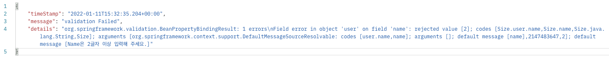
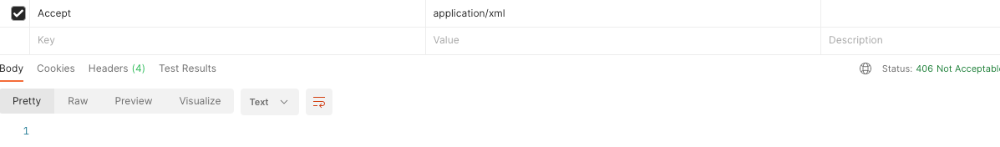
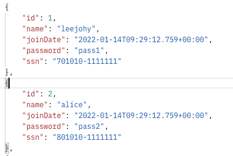
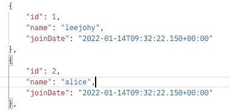
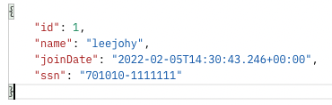

## 3. RESTful Service 기능 확장

<br>

### Section 3 수업 소개
- Validation : 새로운 사용자 추가를 위한 클라이언트 입력 값에 대해 오류가 있는지 체크
- Internationalizaition : 서비스에서의 다국어 처리를 위한 라이브러리 사용
- XML format으로 반환하기 : 지금까지는 json 사용 > xml로 변환하는 방법에 대해 알아보기
- Filtering : User 클래스에 정의된 정보 중, 클라이언트에 보여질 정보 / 숨겨질 정보를 필터링
- Version 관리 : 개발한 어플리케이션을 버전별로 구분해서 서비스 할 수 있는 버전 관리 기능

<br>

### 유효성 체크를 위한 Validation API 사용 
- JDK, Hibernate에 포함된 API를 사용할 수 있다.
- User의 name, joinDate에 유효성 체크를 진행해보자.

````java
public class User {
    private Integer id;

    @Size(min=2)
    private String name;

    @Past
    private Date joinDate;
}
````

````java
    @PostMapping("/users") 
    public ResponseEntity<User> createUser(@Valid @RequestBody User user) { 
        User savedUser = service.save(user);
    // ...     
````
- 우선 pom.xml에 `spring-boot-starter-validation`를 추가한다.
- name에는 2이상의 길이 제한을 두었다.
- joinDate에는 과거데이터만 올 수 있다는 제약 조건을 두었다.
- Postman을 통해 name이 2이상이 아닐 경우, 4xx로 응답하도록 구현하였다. controller의 User 앞에 @Valid를 넣으면 된다.

<br>

이번에는 body에 적절한 메시지를 출력하도록 해보자. ``ResponseEntityExceptionHandler``내의 아래 메서드를 재정의 한다.
재 정의를 ``CustomizedResponseEntityExceptionHandler``에 구현하면 된다.

````java
    // 재정의 전 
    protected ResponseEntity<Object> handleMethodArgumentNotValid(MethodArgumentNotValidException ex, HttpHeaders headers, HttpStatus status, WebRequest request) {
        return this.handleExceptionInternal(ex, (Object)null, headers, status, request);
    }
    
    // 재정의 후
    protected ResponseEntity<Object> handleMethodArgumentNotValid(MethodArgumentNotValidException ex, HttpHeaders headers, HttpStatus status, WebRequest request) {
    
        ExceptionResponse exceptionResponse = new ExceptionResponse(new Date(),
        "validation Failed", ex.getBindingResult().toString()); // time, message, details 순서

        return new ResponseEntity(exceptionResponse, HttpStatus.BAD_REQUEST);
    }
````
- 즉, 우리의 방식대로 ``ExceptionResponse``를 반환하도록 구현한다.
- `ExceptionResponse`에는 timeStamp, message, details를 인자로 받도록 우리가 구현하였다.. 
- 기존의 첫번째 인자인 `MethodArgumentNotValidException`로 발생한 exception 객체가 전달된다. 디테일한 정보는 여기에서 얻을 수 있다.
- 따라서 message에는 사용자 지정 String인 "validation Failed"를 출력하도록 했다.
- 해당 예외 Response를 반환한다.

<br>

#### 결과


- message에 앞서 전달한 내용이 출력된다.
- default message는 User 객체 내의 message에서 변경할 수 있다.
````java
    @Size(min=2, message = "Name은 2글자 이상 입력해 주세요.")
    private String name;
````

<br>

---

### 다국어 처리를 위한 Internationalization 구현 방법
- 출력 값을 여러가지 언어로 표현하는 기능이다. 
- 다국어 처리에 대한 예시로, 우리는 웹 브라우저의 기본 설정에 따라 한국어 또는 영어 페이지를 볼 수 있다.  
- 특정 컨트롤러가 아닌, 프로젝트 전반에 걸쳐서 적용시켜야하기 때문에 스프링 부트 초기화 시 bean이 메모리에 등록할 수 있도록 구현한다.


<br>

#### Main Application

````java
    @Bean
public LocaleResolver localeResolver() {
    SessionLocaleResolver localeResolver = new SessionLocaleResolver(); // 세션을 통해 LocaleResolver를 가져온다.
    localeResolver.setDefaultLocale(Locale.KOREA); // 기본 KOREA로 지정한다.
    return localeResolver;
    }
````
- 세션을 통해 ``Locale`` 값을 가져오고, 기본 값을 지정해서 반환한다.
- `@SpringBootApplication`에서 빈을 등록하면 어플리케이션 시작 시점에서 빈에 적용이 된다.

<br>

#### application.yml
````yaml
# 우리가 사용할 다국어 파일을 설정해놓는다.
spring:
  messages:
    basename: messages # 우리가 사용할 기본 다국어 파일의 이름을 messages라고 지정한다.
````
- 다국어 파일의 이름을 messages로 지정하겠다는 의미이다. ``resources`` 아래 ``messages.properties``라는 파일을 만든다.

<br>

#### messages.properties
````properties
# messages.properties (default)
greeting.message=안녕하세요 {0}, 닉네임이 {1}이라면서요?

# messages_en.properties 
greeting.message=Hello {0}, is Your NickName {1} ?

# messages_fr.properties
greeting.message=Bonjour {0} {1}
````

<br>

#### HelloWorldController
````java
    @GetMapping("/hello-world-internationalized")
    public String helloWorldInternationalized(
        @RequestHeader(name = "Accept-Language", required = false) Locale locale) {
        return messageSource.getMessage("greeting.message", new String[] {"leejohy", "Lucid"}, locale);
    }
````
- ``@RequestHeader``를 통해 `Accept-Language`를 가져와서 locale에 할당한다. 전달되지 않는다면 앞서 main에서 등록된 ``locale(korea)``이 기본으로 적용된다.
- ``@Autowired``를 통해 `messageSource`를 주입받는다. 하지만 필드 주입은 권장하지 않는다.
- 우리가 만든 ``resource bundle file``로부터 지정한 메시지를 가져와서 출력할 수 있다. 두 번째 인자는 properties의 {0} 안으로 들어가서 출력할 수 있다.

<br>

#### 정리
- MessageSource는 사용자로부터의 요청에 대한 결과를 처리하는 과정에서 발생하는 문자열을 
  각 언어별로 새로운 HTML 페이지를 생성하지 않게 하기 위한 메시지 표시를 위한 객체로써, 
  getMessage()라는 메소드에 필요한 Key를 요청하게 되면, 해당 Value를 message.properties 파일에서 
  검색하여 반환하게 됩니다. 이때 Locale 정보를 같이 전달할수도 있으며, 전달하지 않을 경우에는 LocaleResolver에서 
  설정한 기본 값을 사용하게 됩니다. 예를 들어 아래와 같이 사용하실 수도 있습니다.  
  ````java
  @GetMapping(path = "/hello-world-internationalized")
    public String helloWorldInternationalized(
    @RequestHeader(name = "Accept-Language", required = false) Locale locale,
    HttpServletRequest request) {
        if (locale == null)
            locale = localeResolver.resolveLocale(request);

        return messageSource.getMessage("greeting.message", null, locale);
    }
  ````
- 위에서는 사용자로부터 Locale 정보가 없다면, ``localeResolver``로부터 직접 locale 정보를 가져오게 됩니다.
- 마찬가지로 `localeResolver`도 빈으로 등록되어 있으므로(앞서 우리가 등록했다) 생성자 주입등을 통해 가져올 수 있게 됩니다.
- 즉, 이번 챕터에서 작성한 코드와 완전히 동일한 동작을 수행하게 됩니다. 위처럼 굳이 가져올 필요는 없이 `default`로 설정한 한국어가 나올겁니다.

<br>

---

### Response 데이터 형식 변환 - XML format
- 이번에는 ``json``이 아닌 ``xml format``으로 데이터를 반환할 것이다.
- ``HEADER``의 ``Accept``에 ``application.xml``을 작성하고 /users를 대상으로 get 메서드를 보내보자.



- xml 전달 시, ``406 Not Acceptable``이 발생한다.

#### 라이브러리 추가
- pom.xml(maven)에 다음 내용을 추가한다. 이를 통해 `mappingJackson2XmlHttpMessageConverterConfiguration`이 추가된다.
- 이를 통해 ``HttpMessageConverter``에서 xml 사용이 가능해진다.
````xml
        <dependency>
            <groupId>com.fasterxml.jackson.dataformat</groupId>
            <artifactId>jackson-dataformat-xml</artifactId>
        </dependency>
````

- 서버 재시작 후 POSTMAN으로 재 요청을 보내면 정상적으로 아래처럼``xml``출력이 리턴된다. ``json``요청도 문제 없이 동작한다.
````xml
<List>
    <item>
        <id>1</id>
        <name>leejohy</name>
        <joinDate>2022-01-14T09:20:47.618+00:00</joinDate>
    </item>
    <item>
        <id>2</id>
        <name>alice</name>
        <joinDate>2022-01-14T09:20:47.618+00:00</joinDate>
    </item>
    <item>
        <id>3</id>
        <name>lucid</name>
        <joinDate>2022-01-14T09:20:47.618+00:00</joinDate>
    </item>
</List>
````

<br>

---

### Response 데이터 제어를 위한 Filtering
- ``password, ssn``과 같은 중요한 데이터를 제어하는 방법을 알아보자. 아래처럼 바로 클라이언트에게 반환하지 않을 방법은?



<br>

#### 가장 간단한 방법
- 특정 필드를 다른 문자로 반환해주는 방법이 있다.
- 또는 특정 필드를 ``null``로 반환해주는 방법이 있다.
- 하지만, 5개의 필드가 전달되는 것은 변함이 없다.

<br>

#### ``Springboot``에서 사용하는 jackson을 통해 제어를 해보자.
- 특정 필드에 `@JsonIgnore`를 작성한다. 
````java
    @JsonIgnore
    private String password;
    @JsonIgnore
    private String ssn;
````

- 결과로 아래와 같이 해당 필드가 사라져서 반환된다.



- 또는 아래처럼 `@JsonIgnoreProperties`의 `value`에 추가하여 동일한 결과를 얻을 수 있다.
- ``Ignore``는 해당 어노테이션이 적용된 클래스를 상속받은 객체의 필드에도 마찬가지로 적용된다.
````java
@Data
@AllArgsConstructor
@JsonIgnoreProperties(value = {"password", "ssn"}) // 특정 필드에 Ignore 적용
public class User {

    private Integer id;
    //...
}
````

<br>

---

### 프로그래밍으로 제어하는 Filtering 방법 - 개별 사용자 조회

클라이언트에 제공하는 필드를 어노테이션이 아닌 Jackson라이브러리를 통한 프로그래밍적인 기법으로 필터링 해보자. 앞서 사용하고 있던 `UserController`를 복사해서 사용한다.

<br>

1. 먼저 User에 필터될 빈의 이름을 설정한다. 이 이름을 통해 이후에 필터를 진행할 것이다.
````java
@JsonFilter("UserInfo")
public class User {
  // ...
}
````

<br>

2. 새로운 컨트롤러에 새로운 매핑을 추가한다. 
- ``SimpleBeanPropertyFilter``를 통해 통과시킬 프로퍼티를 지정한다.
- 이를 ``FilterProvider``에 필터빈 이름과 함께 전달한다.
- ``MappingJacksonValue``를 만들 때 ``setFilter``를 통해 커스텀 필터를 세팅한다. 
````java
    @GetMapping("/users/{id}")
    public MappingJacksonValue retrieveUser(@PathVariable int id) {
        User user = service.findOne(id);

        if (user == null) {
            throw new UserNotFoundException(String.format("ID[%s] not found", id));
        }

        /**
         * filter를 통해 어노테이션 대신 코드레벨에서 직관적인 제어가 가능하다.
         * filterOutAllException으로 지정된 프로퍼티만 통과하도록 한다.
         */
        SimpleBeanPropertyFilter filter = SimpleBeanPropertyFilter
            .filterOutAllExcept("id", "name", "joinDate", "ssn");

        // 앞서 만든 필터를 FilterProvider에게 전달한다.
        FilterProvider filters = new SimpleFilterProvider().addFilter("UserInfo", filter);

        // JacksonValue를 만들고, 여기에 FilterProvider를 세팅한다.
        MappingJacksonValue mapping = new MappingJacksonValue(user);
        mapping.setFilters(filters);

        return mapping;
    }
````

<br>

#### 결과



필터링한 데이터만 반환된다. 앞서 ``User``에 ``JsonFilter``를 적용하였으므로, 원래 사용되던 controller 요청은 오류가 발생한다.

<br>

---

### 프로그래밍으로 제어하는 Filtering 방법 - 전체 사용자 조회

