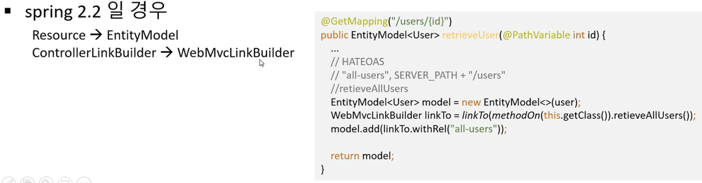
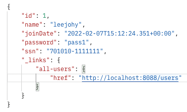

## 4. Spring Boot API 사용

<br>

### Section 4 수업 소개

- REST API level3를 위한 HATEOAS 설정. 추가 상태 정보를 알아보기
- REST API Documentation을 위한 Swagger 설정(개발 dom 문서 추가)
- REST API Monitoring을 위한 Actuator 설정(상태 모니터링)
- Spring Security를 통한 간단한 인증 절차

<br>

### Level3 단계의 REST API 구현을 위한 HATEOAS 적용 
- HATEOAS : Hypermedia As the Engine Of Application State
   - 현재 리소스와 연관된(호출 가능한) 자원 상태 정보(uri)를 제공 


- Level 0 : 컴퓨터가 가진 자원을 의미없이 전달하는 단계
- Level 1 : Resource 
- Level 2 : HTTP 상태 메서드를 이용하는 단계
- Level 3 : 리소스의 정보를 함께 제공하는 단계

앞서 Section 3까지 했던 것은 Level 2까지 구현한 단계이다.

pom.xml을 먼저 수정하자.(add dependency)
````xml
<dependency>
    <groupId>org.springframework.boot</groupId>
    <artifactId>spring-boot-starter-hateoas</artifactId>
</dependency>
````

<br>

spring 버전에 따라 HATEOS의 사용 방식이 다르다. 나는 2.2이상이므로 다음 내용을 적용한다.


<br>

코드 적용 결과는 다음과 같다.
````java
        // HATEOAS를 여기에 적용해보자.
        EntityModel<User> model = EntityModel.of(user);
        WebMvcLinkBuilder linkTo = linkTo(methodOn(this.getClass())
            .retrieveAllUsers());
        model.add(linkTo.withRel("all-users")); // model에 링크를 추가(어떤 uri와 연결할 지 설정)
        return model;
````
- 우선 user를 대상으로 EntityModel을 생성한다. 
- WebMvcLinkBuilder.linkTo를 통해 새로운 링크를 형성한다. retrieveAllUser 메서드에 쓰여진 링크를 가져온다. 이는 ``/users``이다.
- EntityModel에 링크를 추가한다. 이 때 이름은 "all-users"로 지정한다. 이 내용이 이후 JSON FORMAT에서 반환될 때 출력될 것이다.

<br> 

요청 결과는 다음과 같다.(앞서 설정했던 User에 대한 filter는 꺼두자.)


- 반환 결과로 추가 정보를 제공한다. 이건 어디에 활용될까?
- 예를 들어, 사용자가 회원 가입을 했다고 가정하자. 사용자 등록 이후에 사용자의 기본 키를 알기 위해서는 한번 더 서버에 요청을 해야 한다. 
- 이 과정에서 users를 제공하여, 실제 데이터베이스에 저장된 후에 생성되는 user의 key를 알 수 있게 된다.
- 이와 같이 반환 값으로 사용되는 정보에 현재 상태(권한 등을 요청해서)에서 사용할 수 있는 또 다른 링크의 주소를 같이 얻을 수 있다. 이게 장점이다.