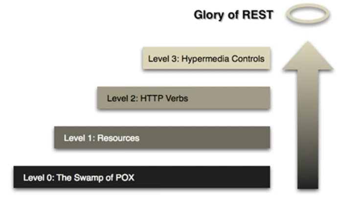

## 4. Spring Boot API 사용

<br>

### Section 4 수업 소개

- REST API level3를 위한 HATEOAS 설정. 추가 상태 정보를 알아보기
- REST API Documentation을 위한 Swagger 설정(개발 dom 문서 추가)
- REST API Monitoring을 위한 Actuator 설정(상태 모니터링)
- Spring Security를 통한 간단한 인증 절차

<br>

### Level3 단계의 REST API 구현을 위한 HATEOAS 적용 
- HATEOAS : Hypermedia As the Engine Of Application State
   - 현재 리소스와 연관된(호출 가능한) 자원 상태 정보를 제공 


- Level 0 : 컴퓨터가 가진 자원을 의미없이 전달하는 단계
- Level 1 : Resource 
- Level 2 : HTTP 상태 메서드를 이용하는 단계
- Level 3 : 리소스의 정보를 함께 제공하는 단계

앞서 Section 3까지 했던 것은 Level 2까지 구현한 단계이다.

pom.xml을 먼저 수정하자.(add dependency)
````xml
<dependency>
    <groupId>org.springframework.boot</groupId>
    <artifactId>spring-boot-starter-hateoas</artifactId>
</dependency>
````